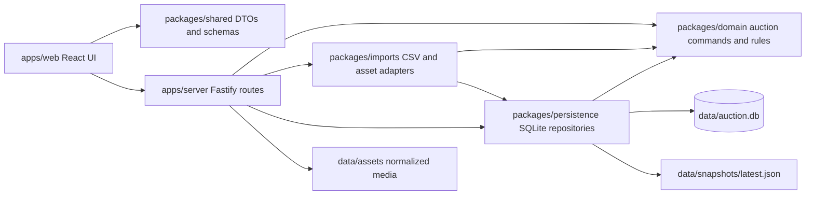
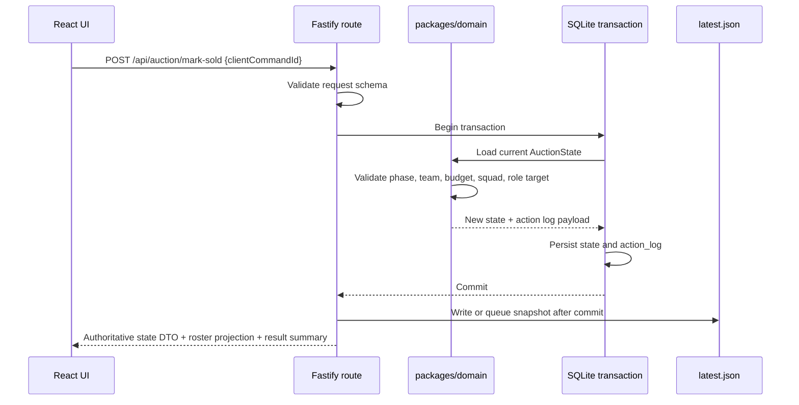
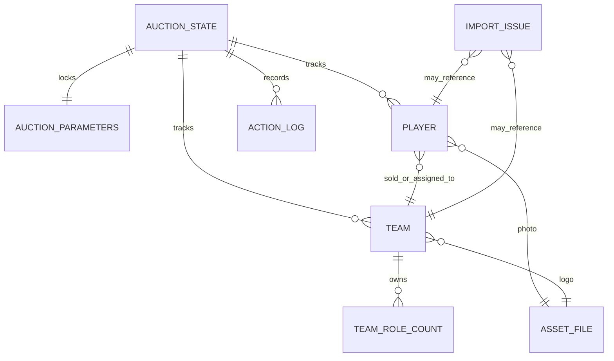

# Architecture Spine - Auction Manager

## Design Paradigm

Local modular monolith with domain-first layered boundaries.

Event mode is one local Node.js process serving the built React app, local API, normalized assets, and health endpoint. The code is split by responsibility, not by deployable service: React presents, Fastify adapts HTTP/files, `packages/domain` owns auction truth, persistence commits state, and import adapters normalize uncontrolled local inputs.



## Invariants & Rules

### AD-1 - Local Modular Monolith [ADOPTED]

- **Binds:** All v1 capabilities, event runtime, implementation structure.
- **Prevents:** One team building a cloud/distributed app while another builds a browser-only or desktop-first app.
- **Rule:** v1 has one local deployable in event mode. Logical modules are `apps/web`, `apps/server`, `packages/domain`, `packages/persistence`, `packages/imports`, and `packages/shared`; no v1 feature may require cloud infrastructure, a hosted database, Docker at runtime, separate services, or public deployment.

### AD-2 - Domain Package Owns Auction Truth [ADOPTED]

- **Binds:** FR-2, FR-5, FR-7, FR-11 through FR-20, SM-2, SM-3, SM-4.
- **Prevents:** Pricing, budget, squad, role-target, phase, randomization, unsold bidding, manual-assignment, and undo rules being reimplemented differently in UI, route handlers, setup adapters, and persistence.
- **Rule:** `packages/domain` is the only module allowed to decide auction phase transitions, sale validity, bid increments, role capacity, derived base prices, Phase 1 player order, Phase 2 unsold-player order, phase-entry gates, manual assignment eligibility, assignment budget effects, undo semantics, reset eligibility, and close eligibility. React and Fastify may request commands and display results; they may not author auction outcomes.

### AD-3 - Server-Authoritative State [ADOPTED]

- **Binds:** FR-7 through FR-22, live board UX, Team rosters UX, recovery/resume.
- **Prevents:** The mirrored board showing client-local state that differs from persisted auction state.
- **Rule:** The server/domain layer is the authoritative state owner after setup begins. React may hold only view state, form state, focus state, and pending-command affordances. Every successful mutating command returns the new authoritative room-ready state DTO, including board and roster projections where relevant; the UI reconciles to that response.

### AD-4 - Command-Oriented Same-Origin HTTP [ADOPTED]

- **Binds:** Setup imports, live auction commands, undo, reset, close, resume.
- **Prevents:** Generic CRUD patches, broad CORS, duplicate double-click mutations, and API routes that expose persistence tables.
- **Rule:** The v1 API uses same-origin HTTP on localhost. Reads use `GET /api/state`; mutations use intent-named `POST` commands such as `/api/auction/reveal-next`, `/api/auction/mark-sold`, and `/api/auction/undo`. Every mutating command accepts `clientCommandId`, validates request and response schemas, and returns authoritative state plus a compact result summary.

### AD-5 - Atomic SQLite Persistence [ADOPTED]

- **Binds:** FR-19, FR-20, reliability requirements, restart/resume.
- **Prevents:** Partial sales, partial manual assignments, undo history loss, and continuing live flow after a failed write.
- **Rule:** SQLite current-state tables plus `action_log` are the durable authority. Every setup or live state mutation executes in one SQLite transaction, appends any required action-log entry, updates current-state tables, and writes or schedules `data/snapshots/latest.json` only after commit. If persistence fails, the server rejects further mutating commands until the failure is cleared or the operator chooses an explicit recovery path.

### AD-6 - Undo Scope Is Action-Log Based [ADOPTED]

- **Binds:** FR-19, FR-21, FR-22, dangerous operations UX.
- **Prevents:** Reset/close being accidentally reversible in one slice while excluded elsewhere, or undo restoring only part of a sale.
- **Rule:** Undo is implemented from action-log inverse or before/after payloads for reveal next player, select team, increase bid, mark sold, mark unsold, start unsold bidding, start manual assignment, and manual assignment. Undo restores all affected player, team, bid, selected-team, role-count, budget, assignment-budget effect, phase, pending-pool, skipped-player, and randomized-order fields. Reset Auction and Close Auction are dangerous commands, confirmed separately, and never appear in the undo stack.

### AD-7 - Setup Imports Are Staged Adapters [ADOPTED]

- **Binds:** FR-1 through FR-6, FR-20, setup UX.
- **Prevents:** Live auction logic depending on arbitrary source CSV/image files or discovering required source defects during bidding.
- **Rule:** Player CSV, player photos, Team CSV, and logos enter through import adapters that parse, validate, match, normalize, and copy data into managed app storage before Start Auction. Player CSV required headers are the PRD FR-1 source headers. Team CSV required headers are `Team Name` and `Captain Name`; aliases, if supported, belong only inside the import adapter and its tests. Import adapters emit structured `import_issues` with severities `must_fix`, `can_proceed_with_placeholder`, and `ignored_source_field`; Start Auction is blocked while any `must_fix` issue remains.

### AD-8 - Privacy By Projection [ADOPTED]

- **Binds:** PRD privacy requirements, UX privacy floor, FR-9, SM-C3, Team rosters.
- **Prevents:** Private registration fields appearing on the projected board or roster screen because they exist in source CSV or persistence.
- **Rule:** Board, roster, and live API DTOs are allowlisted projections containing only player name, photo/placeholder, role, base price, current bid, status, sold price, acquisition type, winning/assigned team, team name, captain, logo/placeholder, budget, squad count, and role counts. Email, mobile number, payment status, payment transaction ID, source timestamp, and non-auction registration fields must not be present in board, roster, log, or snapshot DTO types.

### AD-9 - Local File Security Boundary [ADOPTED]

- **Binds:** FR-3, FR-4, setup imports, local state files, asset serving.
- **Prevents:** Path traversal, serving arbitrary local files, storage bloat, source filename leakage, and accidental LAN exposure.
- **Rule:** Event mode binds to `127.0.0.1` by default and serves UI, API, and assets from one origin. CORS is disabled in event mode, mutating routes reject unexpected `Origin`/`Host`/`Content-Type`, and multipart is accepted only on setup upload routes. Uploads use extension allowlists, content checks where practical, file size and count limits, generated internal asset IDs, and controlled asset directories under the data directory. The server never serves user-provided filesystem paths directly.

### AD-10 - Event Mode Owns Operations [ADOPTED]

- **Binds:** Reliability, local operation, recovery, deployment and environments.
- **Prevents:** One implementation requiring dev-server pairs, Docker, internet, or manual asset hosting during the live event.
- **Rule:** Development may run Vite plus Fastify with a narrow local proxy. Event mode builds the React app and runs one Fastify process that serves `/api/*`, `/assets/*`, health, and the SPA. Startup checks Node version, data directory writability, database open status, and configured asset paths before live commands are enabled.

### AD-11 - Tests Protect Architectural Invariants [ADOPTED]

- **Binds:** Rule correctness, recovery, route contracts, privacy, setup imports.
- **Prevents:** UI-only confidence hiding invalid sales, broken undo, restart loss, or private-field display regressions.
- **Rule:** Rule, parameter, phase, or roster-projection changes require Vitest domain-command tests. Persistence changes require transaction, resume, action-log, and snapshot tests with a temporary SQLite DB. Fastify routes require `inject()` tests for schema validation and conflict status codes. Playwright covers setup import, auction-parameter locking, happy-path sale, invalid sale block, undo after sale, Phase 2 unsold bidding, Phase 3 manual assignment, roster updates after sale/assignment/undo, restart/resume across both unsold phases, final roster display after Close Auction, and live-board/roster privacy.

### AD-12 - Correctness-First Delivery Order [ADOPTED]

- **Binds:** Epic/story sequencing and implementation readiness.
- **Prevents:** A polished live board being built before auction rules, durable state, and recovery are trustworthy.
- **Rule:** Implementation proceeds scaffold -> domain -> persistence -> API -> imports/assets -> operator/display UI -> event-mode rehearsal. A slice is complete only when the relevant build, typecheck, unit/integration tests, and current event-flow smoke tests pass.

### AD-13 - Auction Parameters Are Setup-Owned And Locked [ADOPTED]

- **Binds:** FR-2, FR-5, FR-6, FR-12 through FR-18, FR-20.
- **Prevents:** Current league defaults being hard-coded as application constants, setup/API/domain slices choosing incompatible pricing or rule shapes, or mid-auction parameter edits changing historical validity.
- **Rule:** Auction Creation captures role base prices, bid increment, team budgets, player cap, role targets, and manual-assignment budget behavior as structured Auction Parameters in shared/domain schemas. Manual-assignment budget behavior is a domain enum with v1 default `NoBudgetImpact`; additional enum values require domain validation, persistence, API schema, and tests in the same slice. Parameters are validated before Start Auction, persisted with the auction, used by domain commands for all derived prices and eligibility checks, and locked after Start Auction. Changing them for a live auction requires Reset Auction or creating a new auction.

### AD-14 - Three-Phase Auction State Machine [ADOPTED]

- **Binds:** FR-15 through FR-20, SM-4.
- **Prevents:** One slice collapsing unsold bidding into manual assignment while another builds a separate randomized rebid phase, or Phase 2 being implemented as random assignment instead of normal bidding.
- **Rule:** The auction state machine has separate live phases for `InitialAuction`, `UnsoldBidding`, and `ManualAssignment`. Phase 1 unsold players enter the Phase 2 pool; starting Phase 2 creates and persists one randomized unsold-player bidding order; Phase 2 uses the same reveal, select-team, increase-bid, mark-sold, mark-unsold, hard-block, and undo rules as Phase 1; players marked unsold in Phase 2 enter the Phase 3 manual-assignment pool. Phase 3 allows only operator-selected assignment to valid Teams under squad, role-target, and configured assignment-budget rules. Normal phase entry is blocked while prior-phase pending players remain unless an explicit skip path records the skipped players and is undoable.

### AD-15 - Team Rosters Are Derived Projections [ADOPTED]

- **Binds:** FR-9, FR-14, FR-18, FR-20, FR-22, Team rosters UX.
- **Prevents:** Team roster screens, Team detail drawers, final closed-auction display, persistence, and undo logic disagreeing about which Players a Team owns.
- **Rule:** Team rosters are read projections from authoritative Player ownership fields, not independently mutable Team state. `MarkSold`, Phase 2 sold outcomes, `AssignManualPlayer`, `Undo`, resume, and `CloseAuction` must expose or return authoritative roster projection data derived from Players assigned to Teams through sale or manual assignment. `CloseAuction` changes phase and final display state only; it must not change Player ownership. A Board/Rosters view switch is UI navigation only and must not mutate auction state. If an implementation adds a materialized roster cache for performance, it is rebuilt from Player ownership inside the same transaction boundary and is never command-addressable as a separate source of truth.

## Consistency Conventions

| Concern | Convention |
| --- | --- |
| Package names | `apps/web`, `apps/server`, `packages/domain`, `packages/persistence`, `packages/imports`, `packages/shared` |
| Entity names | `Player`, `Team`, `AuctionState`, `AuctionParameters`, `ActionLogEntry`, `ImportIssue`, `AssetFile` |
| Read projection names | `BoardStateDto`, `TeamRosterDto`, `RosterPlayerDto`; projections derive from `AuctionState`, `Player`, and `Team`, never from direct table exposure |
| Phase names | `Setup`, `InitialAuction`, `UnsoldBidding`, `ManualAssignment`, `Closed` |
| Command names | Imperative domain verbs: `ConfigureAuctionParameters`, `StartAuction`, `RevealNextPlayer`, `SelectTeam`, `IncreaseBid`, `MarkSold`, `MarkUnsold`, `StartUnsoldBidding`, `StartManualAssignment`, `AssignManualPlayer`, `Undo`, `ResetAuction`, `CloseAuction` |
| IDs | Generated opaque string IDs for persisted entities and assets; no source filename or row-number IDs exposed as stable domain IDs |
| Roles | Canonical enum values: `Ace`, `Batting`, `Bowling`, `AllRounder`, `Girls`; source labels such as `All Rounder` and `Women` are normalized at import/setup |
| Import headers | Player CSV headers follow PRD FR-1 exactly; Team CSV canonical headers are `Team Name` and `Captain Name` |
| Money and counts | Integer units only; setup defaults are role base prices `Ace 10`, `Batting 8`, `Bowling 6`, `Girls/Women 6`, bid increment `2`, team budget `170`, squad max `13`, role targets `Ace 2`, `Batting 3`, `Bowling 2`, `AllRounder 2`, `Girls 2`; defaults are editable before Start Auction and locked afterward |
| Manual assignment budget behavior | Domain enum persisted in Auction Parameters; v1 default is `NoBudgetImpact` |
| Dates and times | ISO 8601 strings in API/snapshot payloads; SQLite stores timestamps as UTC text or integer epoch consistently per schema |
| API errors | `400` invalid input, `409` phase/rule conflict, `413` upload too large, `415` unsupported media, `500` unexpected server fault without stack traces in UI |
| State mutation | All live mutations call a domain command and commit through persistence; no direct table patching from routes and no direct roster mutation |
| Randomness | Phase 1 category ordering and Phase 2 unsold bidding ordering are generated in domain services and persisted immediately; Phase 3 manual assignment is operator-selected, not random |
| Logging | Append command summary, `clientCommandId`, timestamp, outcome, and undo payload where applicable; never log private source fields unless needed for local setup diagnostics |
| Config | Data directory, port, host binding, upload limits, and asset limits are server config validated at startup |
| Auth | No accounts, login, RBAC, OAuth, JWT, or API keys in v1 localhost mode |

## Stack

| Name | Version |
| --- | --- |
| Node.js | 24.18.0 LTS; event engine `>=24 <25` |
| npm workspaces | npm 11.16.0 |
| TypeScript | 6.0.3 with `strict` enabled |
| React | 19.2.7 |
| Vite | 8.1.3 |
| Fastify | 5.9.0 |
| SQLite | 3.53.2 via `better-sqlite3` |
| better-sqlite3 | 12.11.1 |
| Zod | 4.4.3 |
| csv-parse | 5.6.0 |
| Sharp | 0.35.3 |
| Tailwind CSS | 4.3.2 |
| Lucide React | 1.23.0 |
| Vitest | 4.1.9 |
| Playwright | 1.61.1 |

## Structural Seed

```text
auction_manager/
  apps/
    web/              # React operator and mirrored board UI
    server/           # Fastify startup, routes, static serving, upload handling
  packages/
    domain/           # Auction commands, phases, rules, reducers, undo semantics
    persistence/      # SQLite schema, repositories, transactions, snapshots
    imports/          # CSV parsers, photo/logo matching, image normalization
    shared/           # DTOs, API schemas, constants shared across apps
    test-fixtures/    # Sample CSVs, teams, media fixtures, dry-run scenarios
  data/
    auction.db        # Local authoritative event database
    assets/
      players/        # Normalized player images
      teams/          # Normalized team logos
    snapshots/
      latest.json     # Readable recovery/export snapshot
```





```mermaid
flowchart TB
  Operator[Operator PC browser] --> Localhost[Fastify on 127.0.0.1]
  Projector[Mirrored display] --> Operator
  Localhost --> SPA[Built React SPA]
  Localhost --> API[/api]
  Localhost --> StaticAssets[/assets]
  API --> DB[(data/auction.db)]
  API --> Files[data/assets and snapshots]
  SourceFiles[CSV/photos/logos selected by operator] --> API
```

## Capability -> Architecture Map

| Capability / Area | Lives in | Governed by |
| --- | --- | --- |
| FR-1 Load player CSV | `packages/imports`, `apps/server`, `packages/persistence` | AD-7, AD-9 |
| FR-2 Configure role-based base prices | `packages/domain`, `packages/shared`, setup UI, `packages/persistence` | AD-2, AD-13 |
| FR-3 Match local player photos | `packages/imports`, managed assets | AD-7, AD-9 |
| FR-4 Load team CSV and logos | `packages/imports`, managed assets | AD-7, AD-9 |
| FR-5 Configure auction parameters | `packages/domain`, `packages/shared`, setup UI, `packages/persistence` | AD-2, AD-13 |
| FR-6 Start auction | `packages/domain`, `packages/persistence`, `apps/server` | AD-2, AD-5, AD-7, AD-13 |
| FR-7 Randomize initial player order | `packages/domain`, `packages/persistence` | AD-2, AD-5 |
| FR-8 Reveal next player | `packages/domain`, `apps/server`, `apps/web` | AD-2, AD-3, AD-4, AD-6 |
| FR-9 Display live auction state | `apps/web`, `packages/shared` DTOs | AD-3, AD-8 |
| FR-10 Keep operator controls obvious | `apps/web` | UX spine, AD-3 |
| FR-11 Select bidding team | `packages/domain`, `apps/server`, `apps/web` | AD-2, AD-4, AD-6 |
| FR-12 Increase bid | `packages/domain`, `apps/server`, `apps/web` | AD-2, AD-4, AD-6, AD-13 |
| FR-13 Hard-block invalid sales | `packages/domain` | AD-2, AD-11, AD-13 |
| FR-14 Mark player sold | `packages/domain`, `packages/persistence` | AD-2, AD-5, AD-6, AD-15 |
| FR-15 Mark player unsold | `packages/domain`, `packages/persistence` | AD-2, AD-5, AD-6, AD-14 |
| FR-16 Start second-phase unsold bidding | `packages/domain`, `packages/persistence`, `apps/server`, `apps/web` | AD-2, AD-4, AD-5, AD-6, AD-14 |
| FR-17 Run second-phase bidding for unsold players | `packages/domain`, `packages/persistence`, `apps/server`, `apps/web` | AD-2, AD-3, AD-4, AD-5, AD-6, AD-11, AD-13, AD-14 |
| FR-18 Run third-phase manual assignment | `packages/domain`, `packages/persistence`, `apps/server`, `apps/web` | AD-2, AD-3, AD-5, AD-6, AD-13, AD-14, AD-15 |
| FR-19 Multi-step undo | `packages/domain`, `packages/persistence`, `apps/web` | AD-6, AD-11 |
| FR-20 Persist local auction state | `packages/persistence`, `apps/server` | AD-5, AD-10, AD-13, AD-14, AD-15 |
| FR-21 Reset Auction dangerous operation | `packages/domain`, `apps/web` | AD-6, AD-10 |
| FR-22 Close Auction dangerous operation | `packages/domain`, `apps/web` | AD-3, AD-6, AD-10, AD-15 |
| Team roster display and final closed roster screen | `packages/domain`, `packages/persistence`, `packages/shared`, `apps/server`, `apps/web` | AD-3, AD-5, AD-8, AD-15 |
| Privacy and display minimization | `packages/shared`, `apps/web`, `apps/server` | AD-8, AD-11 |
| Event readiness and recovery | `apps/server`, `packages/persistence`, Playwright | AD-5, AD-10, AD-11, AD-12 |

## Deferred

| Deferred item | Why it can wait | Revisit condition |
| --- | --- | --- |
| Separate audience-only route | v1 uses one mirrored operator/display surface | Mirrored board proves too cluttered in rehearsal or stakeholder asks for second-device display |
| LAN or multi-device display | v1 is one PC and one mirrored display | Display must run on another device or more than one browser needs live updates |
| WebSocket or SSE push | Single mirrored browser can reconcile from command responses and `GET /api/state` | Passive multi-client display is added |
| Accounts, login, RBAC, OAuth, JWT | v1 has one local operator and no public deployment | Server binds beyond localhost or remote users are introduced |
| Hosted database or cloud deployment | v1 must run without internet during the event | Remote bidding, persistent league management, or multi-organizer operation becomes in scope |
| Desktop packaging with Tauri/Electron | Localhost Node process is enough for v1 rehearsal and event mode | Installation friction blocks event use after the web app works |
| Docker-required runtime | Adds event-machine setup risk without v1 value | Team needs reproducible dev containers after app behavior is proven |
| Google Sheets or Drive API integration | Downloaded files avoid credentials and internet dependency | Source file handling becomes the dominant operator burden across repeated events |
| Mid-auction parameter editing | Parameter locking preserves historical sale and assignment validity | Operator rehearsal shows legitimate same-auction rule corrections are required |
| Assignment optimization or fairness algorithms | v1 uses operator-selected manual unsold assignment with hard validity checks | Manual assignment becomes too slow or stakeholders require fairness optimization |
| HEIC certainty | Sharp is selected, but real event photos must prove target-machine support | Rehearsal with representative player photos fails or produces unacceptable output |
| Full event sourcing, CQRS stores, message brokers | Action log plus current-state tables satisfy undo/recovery | Multiple independent writers, audit replay, or remote integrations become real requirements |
